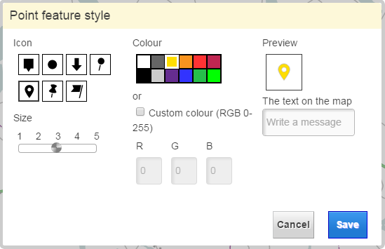

# Markers Plugin

## Description

The plugin offers Marker functionality for the map. Adding, removing markers and event when a marker has been added or clicked.
Also adds a button to toolbar for adding markers.

## TODO

* marker placeholders are much bigger than actual markers. Clicks are registered on placeholder so the click area is too large.

## Screenshot



## Plugin configuration


No configuration is required. Following is optional:
```javascript
{
    markerButton : false
}
```

A toolbar button is added to toolbar by default (if toolbar bundle is present). Config can be used to prevent this.

## Plugin state

Markers on map are saved in state:

```javascript
{
    "markers" : [
        {
            "color":"ffde00",
            "shape":2,
            "msg":"user input",
            "y":7212755,
            "x":427491,
            "size":1
        }
    ]
}
```

## Requests the plugin handles

<table class="table">
  <tr>
    <th>Request</th><th>How does the bundle react</th>
  </tr>
  <tr>
    <td>[MapModulePlugin.AddMarkerRequest](/documentation/requests/addmarkerrequest)</td><td>Adds or modifies marker on the map</td>
  </tr>
  <tr>
    <td>[MapModulePlugin.RemoveMarkersRequest](/documentation/requests/removemarkersrequest)</td><td>Removes one or all markers from map</td>
  </tr>
</table>

## Requests the plugin sends out

<table class="table">
  <tr>
    <th>Request</th><th>Why/when</th>
  </tr>
  <tr>
    <td> Toolbar.AddToolButtonRequest </td><td> Adds a toolbar button for activating marker tool. </td>
  </tr>
  <tr>
    <td> MapModulePlugin.GetFeatureInfoActivationRequest </td><td> Disable GFI while adding a marker. </td>
  </tr>
  <tr>
    <td> WfsLayerPlugin.ActivateHighlightRequest </td><td> Disable feature highlighting while adding a marker. </td>
  </tr>
  <tr>
    <td> Toolbar.SelectToolButtonRequest </td><td> Reset toolbar to default tool after marker has been added. </td>
  </tr>
</table>

## Events the plugin listens to

<table class="table">
  <tr>
    <th> Event </th><th> How does the bundle react</th>
  </tr>
  <tr>
    <td> MapClickedEvent </td><td> When marker tool is activated, adds the marker to the spot indicated by the event.</td>
  </tr>
  <tr>
    <td> AfterHideMapMarkerEvent </td><td> Hides the marker layer.</td>
  </tr>
  <tr>
    <td> Toolbar.ToolbarLoadedEvent </td><td> Registers the toolbar button if toolbar wasn't available on startup.</td>
  </tr>
  <tr>
    <td> SearchClearedEvent </td><td> Removes all markers.</td>
  </tr>
  <tr>
    <td> AfterRearrangeSelectedMapLayerEvent </td><td> Raises the markers layer to top so markers aren't lost behind another map layer.</td>
  </tr>
</table>

## Events the plugin sends out

<table class="table">
  <tr>
    <th>Event</th><th>Why/when</th>
  </tr>
  <tr>
    <td>AfterAddMarkerEvent</td><td> Notifies that a marker has been added and provides an ID for the marker. </td>
  </tr>
  <tr>
    <td>AfterRemoveMarkersEvent</td><td> Notifies that a marker has been removed. If event has a marker ID a single marker was removed, 
    otherwise all markers were cleared </td>
  </tr>
  <tr>
    <td>MarkerClickEvent</td><td> Notifies that a marker has been clicked. Provides the ID of the clicked marker. </td>
  </tr>
  <tr>
    <td>DrawFilterPlugin.SelectedDrawingEvent</td><td> Reset drawing tool before adding a marker. </td>
  </tr>
</table>

## Dependencies

<table class="table">
  <tr>
    <th>Dependency</th><th>Linked from</th><th>Purpose</th>
  </tr>
  <tr>
    <td> [jQuery](http://api.jquery.com/) </td>
    <td> Version 1.7.1 assumed to be linked </td>
    <td> Used to create the UI</td>
  </tr>
  <tr>
    <td> [Raphael](http://raphaeljs.com/) </td>
    <td> Version 2.1.2 assumed to be linked </td>
    <td> Used to create SVG icons </td>
  </tr>
  <tr>
    <td> [OpenLayers](http://openlayers.org/) </td>
    <td> not linked, assumes its linked by map </td>
    <td> Uses OpenLayers.Layer.Vector for marker layer and OpenLayers.Feature.Vector for markers.</td>
  </tr>
</table>
